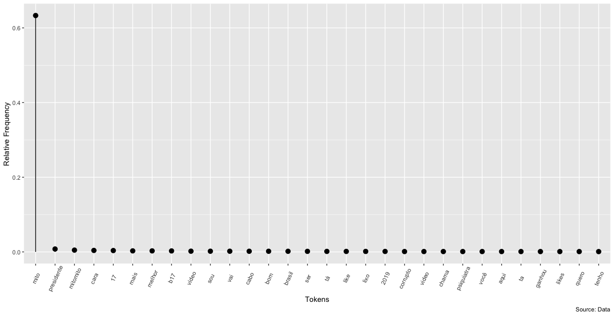
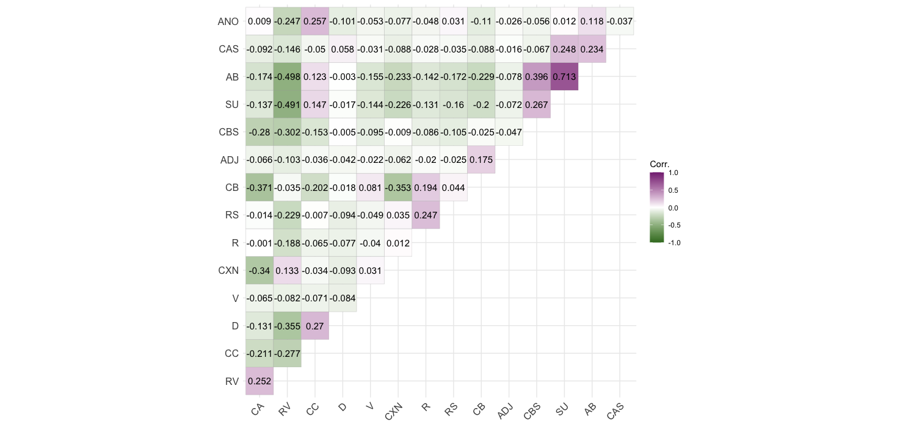
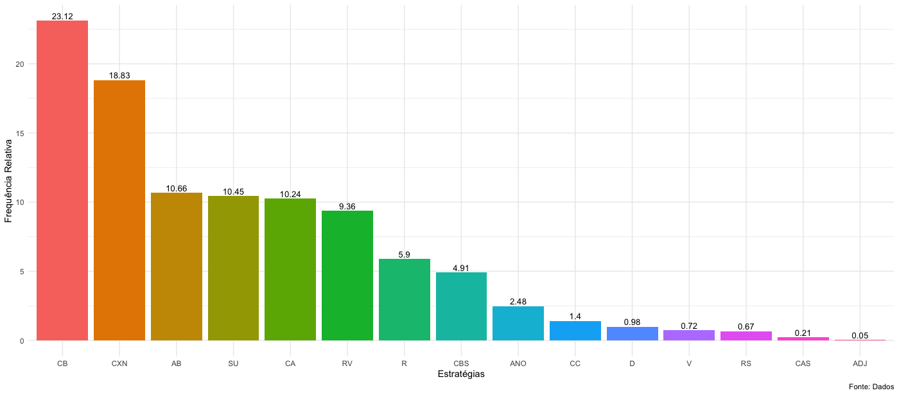

# Plotting: Lexical graduation in the word 'mito' in YouTube Users Comments

[Rodrigo Esteves de Lima Lopes](mailto:rll307@gmail.com)

[Carolina Palma de Sousa Arruda](mailto:carolpalma203@gmail.com)


# Introduction

This script was developed for the analysis of Portuguese. We hope it helps colleagues in the LC area and popularize the use of R. It is part of our research project developed with CNPQ. Please drop us a line if you have any doubts or need any help.

Purpose of this repository

This repository brings the scripts used for lexical analysis of Brazilian Portuguese YouTube comments we wrote for our paper:

Lima-Lopes, R. E. de and Arruda, C. P. S. (2020) Strategies for Gradation in YouTube comments. (under review)

This script is specifically bout plotting.

# Wordlist

Please, note that we cannot make raw data available, so processing wordlists will depend on data scraping.


```r
General.list %>% 
  mutate(tokens = forcats::fct_reorder(word, freq, .desc=TRUE)) %>%
  slice(1:30) %>%
  ggplot(., aes(x=tokens, y=freq))+
  geom_point(size=3) + 
  geom_segment(aes(x=tokens, 
                   xend=tokens, 
                   y=0, 
                   yend=freq)) + 
  labs(caption="Source: Data",
       x = "Tokens",
       y = "Relative Frequency") + 
  theme(axis.text.x = element_text(angle=65, vjust=0.6))
```

The image should look like something like this:



# Correlation

This data is available at `correlation.RData` file.


```r
ggcorrplot(correlation,  type = "upper", lab = TRUE, digits=3,outline.col = "darkgrey",hc.order = TRUE,insig = "blank",show.diag=FALSE,sig.level=0.05,legend.title = "Corr.", ggtheme=ggplot2::theme_minimal(),colors = c("#3e7a2a", "white", "#852e81"))
```

The image should look like something like this:



# Strategies frequency

This data is available at `correlation.RData` file.


```r
colnames(strategies_occurences)<-c('Estrategias','abv','ocorr','freq')
strategies_occurences$freq<-round(strategies_occurences$freq,2)
strategies_occurences %>% 
  dplyr::mutate(abv = forcats::fct_reorder(abv, freq, .desc=TRUE)) %>%
  ggplot(., aes(x=abv, y=freq,fill=as.factor(abv))) +
  geom_bar(stat="identity")+
  geom_text(aes(label=freq), vjust=-0.3, size=3.5)+
  labs(caption="Fonte: Dados",
       x = "Estratégias",
       y = "Frequência Relativa")+
  theme_minimal()+
  theme(legend.position="none")
```

The image should look like something like this:


